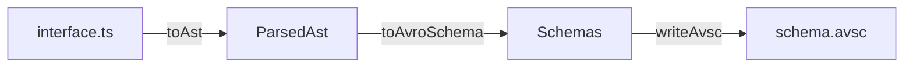
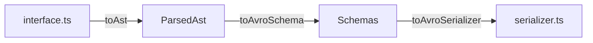

# TypeScript to Avro Schema

## WARNING: This is a WIP, ill-advised project. Use at your own peril.

When producing data, developers often want to use the language they're fluent in to define how their data looks.
Asking a developer to create a schema in the language of the protocol is friction they'd rather not face.

In our case, developers building in TypeScript who want to produce Avro can define their schemas with TypeScript `type`s
and `interface`s.
This tool lets them generate an Avro Schema (`avsc`) out of their TypeScript file.

<!-- TOC -->
* [TypeScript to Avro Schema](#typescript-to-avro-schema)
  * [WARNING: This is a WIP, ill-advised project. Use at your own peril.](#warning-this-is-a-wip-ill-advised-project-use-at-your-own-peril)
  * [Operations](#operations)
    * [1. Convert TypeScript interface or type to Avro Schema](#1-convert-typescript-interface-or-type-to-avro-schema)
    * [2. Convert TypeScript type to serializer](#2-convert-typescript-type-to-serializer)
  * [Features](#features)
    * [Type Conversion](#type-conversion)
    * [Type Narrowing](#type-narrowing)
      * [1. Annotations](#1-annotations)
      * [2. Library Types (WIP)](#2-library-types-wip)
  * [Usage](#usage)
    * [Bootstrapping](#bootstrapping)
    * [Running the damned thing](#running-the-damned-thing)
  * [Contributing](#contributing)
    * [Design](#design)
      * [`typeScriptToAvroSchema`](#typescripttoavroschema)
      * [`typeScriptToSerializerTypeScript`](#typescripttoserializertypescript)
      * [Composed Parts](#composed-parts)
  * [// TODO:](#-todo)
<!-- TOC -->

## Operations

### 1. Convert TypeScript interface or type to Avro Schema

Use this to get a schema you can share (via a schema registry or directly with your consumers).

_input.ts_

```typescript
export interface MyInterface {
    optionalBool?: boolean;
    requiredBytes: Buffer;
    optionalString?: string;
    requiredDouble: number;
}
```

Note that the interface is `export`ed, which is a requirement.

_MyInterface.avsc_

```avro schema
{
    "name": "MyInterface",
    "fields": [
        {
            "name": "optionalBool",
            "type": [
                "null",
                "boolean"
            ]
        },
        {
            "name": "requiredBytes",
            "type": "bytes"
        },
        {
            "name": "optionalString",
            "type": [
                "null",
                "string"
            ]
        },
        {
            "name": "requiredDouble",
            "type": "double"
        }
    ],
    "type": "record"
}
```

### 2. Convert TypeScript type to serializer

Use this when you want to **produce** Avro using a TypeScript interface. \
Generates a typed serializer using
the [avsc](https://github.com/mtth/avsc) library.

_input.ts_

```typescript
export interface MyInterface {
    someField?: string;
}
```

_MyInterface.serializer.ts_

```typescript
import avro from 'avsc';
import {MyInterface} from './input';

const exactType = avro.Type.forSchema({"name": "MyInterface","fields": [{"name": "someField", "type": "string"}],"type": "record"});

export default function serialize(value: MyInterface): Buffer {
    return exactType.toBuffer({
        someField: value.someField === undefined ? null : value.someField
    });
}
```

**Why does the serializer manually convert `undefined`s to `null`s?**

In TypeScript, the idiomatic way to denote optionality is using the `?` modifier.
When an optional field is empty, it is 'set' to `undefined`.
However, in Avro emptiness of optional fields is always denoted using `null`.
The "manual" conversions are a type-safe way of converting between these two idioms.

## Features

### Type Conversion

Avro has types far richer than the default JSON type system, including logical types. However, it is a conscious choice not to create types that complicate users' domain.

Naturally supported types are:
 
| TypeScript | Avro      |
|------------|-----------|
| `boolean`  | `boolean` |
| `Buffer`   | `bytes`   |
| `string`   | `string`  |
| `number`   | `double`  |
| `null`     | `null`    |

**Literal types** are also automatically translated to their respective Avro types. **Optional** fields (e.g. `f?: number`) will produce nullable types (`["null", "number"]`). **Arrays** are translated to Avro arrays, and their item types are converted recursively (also considering [type narrowing](#type-narrowing), if it exists).

### Type Narrowing

If you're looking to further narrow the types you'll be producing, there are two ways to get there:

#### 1. Annotations

By using an annotation, you can let the tool know that you intend to produce a narrower type, e.g.:

```typescript
// @avro int
thisWillBeAnInt: number;
```

Supported types:

| Avro Type Annotation           | Field Type |
|--------------------------------|------------|
| `@avro int`                    | `number`   |
| `@avro float`                  | `number`   |
| `@avro double`                 | `number`   |
| `@avro long`                   | `number`   |
| `@avro date`                   | `number`   |
| `@avro time-millis`            | `number`   |
| `@avro time-micros`            | `number`   |
| `@avro timestamp-millis`       | `number`   |
| `@avro timestamp-micros`       | `number`   |
| `@avro local-timestamp-millis` | `number`   |
| `@avro local-timestamp-micros` | `number`   |
| `@avro uuid`                   | `string`   |

You can see an example of all these conversions from [TypeScript](./tests/cases/003-annotations/input.ts) to [Avro](./tests/cases/003-annotations/output.avsc) in the [tests](./tests/cases/003-annotations).

#### 2. Library Types (WIP)

By using an type from this tool, you can let it know that you intend to produce a narrower type, e.g.:

```typescript
thisWillBeAnInt: AvroInt;
```

The library type is only a type alias of the base JSON type to reduce friction when working with the interfaces.

Supported types:

| Avro Type Annotation       | Field Type |
|----------------------------|------------|
| `AvroInt`                  | `number`   |
| `AvroFloat`                | `number`   |
| `AvroDouble`               | `number`   |
| `AvroLong`                 | `number`   |
| `AvroDate`                 | `number`   |
| `AvroTimeMillis`           | `number`   |
| `AvroTimeMicros`           | `number`   |
| `AvroTimestampMillis`      | `number`   |
| `AvroTimestampMicros`      | `number`   |
| `AvroLocalTimestampMillis` | `number`   |
| `AvroLocalTimestampMicros` | `number`   |
| `AvroUuid`                 | `string`   |

You can see an example of all these conversions from [TypeScript](./tests/cases/008-library-types/input.ts) to [Avro](./tests/cases/008-library-types/output.avsc) in the [tests](./tests/cases/008-library-types).

## Usage

Don't... but if you have to:

### Bootstrapping

1. Clone the repository
2. Make sure to use the Node version in the `.nvmrc` file (I recommend using `nvm install`).
3. Run `npm run bootstrap` to bootstrap the tests.
4. Run `npm run build` to build the Typescript.
5. Run `npm run test` to make sure it all worked.
6. Turn back.

### Running the damned thing

First you'll need to install the command line utility: `npm install -g .`.

Run `ts2avsc --help` to see the following:
```
Usage: ts2avsc [options] <source.ts> [target-directory]

Convert a TypeScript file to a set of Avro Schemas and/or Serializers

Arguments:
source.ts         The typescript file containing the type definitions
target-directory  The directory in which to place the output files (default: ".")

Options:
-V, --version     output the version number
--no-schemas      Generate schemas
--pretty          Pretty print Schema files
--serializers     Generate serializers
-h, --help        display help for command
```

Example usage:

```
🦆 ts2avsc --serializers --pretty tests/cases/007-two-base-types/input.ts ./tests/cases/007-two-base-types

- Writing schemas...
  + Writing Interface7.avsc...
  + Writing Type7.avsc...
- Writing serializers...
  + Writing Interface7.serializer.ts...
  + Writing Type7.serializer.ts...
All done!
```

You can see the input and outputs for this call in [./tests/cases/007-two-base-types](./tests/cases/007-two-base-types).

When you've come to regret your decision, you can get rid of the command line utility with `npm uninstall -g .`.

## Contributing

Sure, I mean, you could, why not :)

### Design

The design is compositional, which can be seen by reading [src/generator/typescript-to-avsc.ts](./src/generator/typescript-to-avsc.ts):

#### `typeScriptToAvroSchema`

Translates an input TypeScript interface into an Avro schema



#### `typeScriptToSerializerTypeScript`

Translates an input TypeScript interface into a typed Avro serializer



#### Composed Parts

1. Files in [src/generator/typescript](./src/generator/typescript) are responsible for parsing the input to an intermediate model.
2. Files in [src/generator/avcs](./src/generator/avsc) are responsible for converting the above model to a model of the Avro schemas and serializing each one.
3. Files in [src/generator/avsc-lib](./src/generator/avsc-lib) are responsible for using the above model of the Avro schema and creating a typed serializer for each supported library.

## // TODO:

1. Test errors and make sure coverage is decent
2. Add language features:
   1. long types
   2. decimal
   3. duration
   4. aliases
   5. default values
   6. order (fields)
   7. enums
   8. maps
   9. unions as fields (ts -> avro)
   10. unions as the type itself
   11. fixed
   12. type references outside the file's scope
   13. not just the interface in the same file
   14. run tests on the serializer/deserializer to make sure they do what they're supposed to
3. Document multiple root types (schema and serializer outputs)
4. Split the command line tool from the types library
5. Consider using actual newtypes for types library

Copyright 2022 Omer van Kloeten

(I'll remove the copyright once this is no longer a WIP project)

Prior art: https://github.com/lbovet/typson
